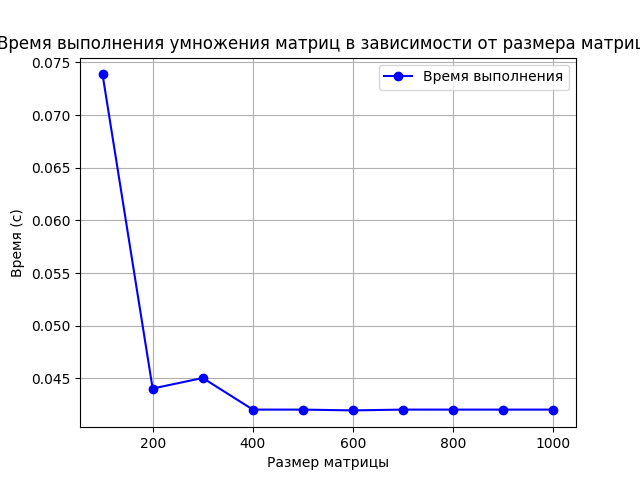

Задание:
Модифицировать программу из л/р №1 для параллельной работы по технологии MPI. 
На языке C++ был реализован алгоритм произведения матриц c поддержкой MPI, последующая проверка корректности результата производилась на Python с использованием библиотеки matplotlib

Результат экспериментов на графике:

